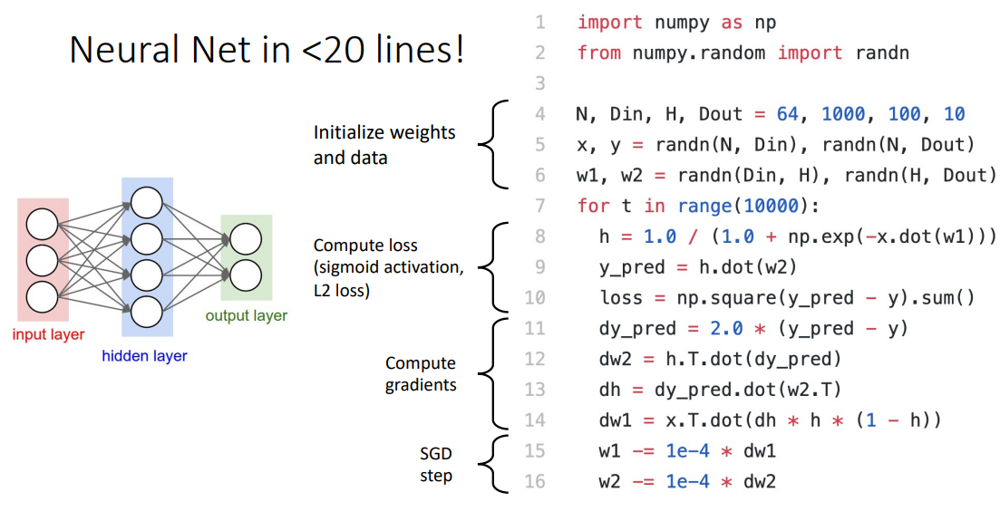
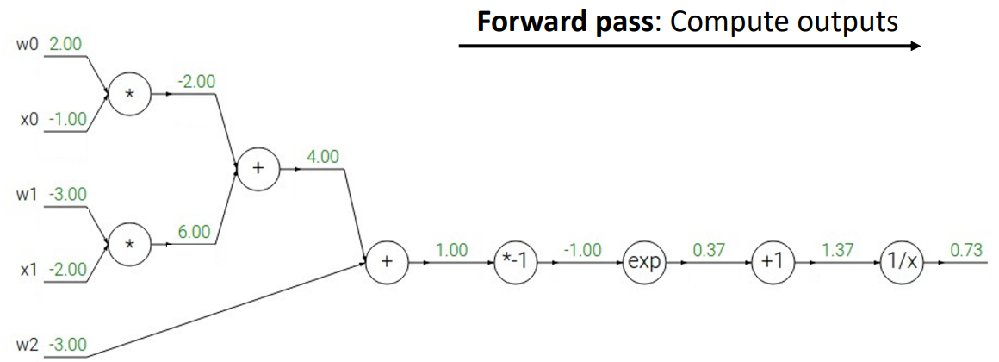
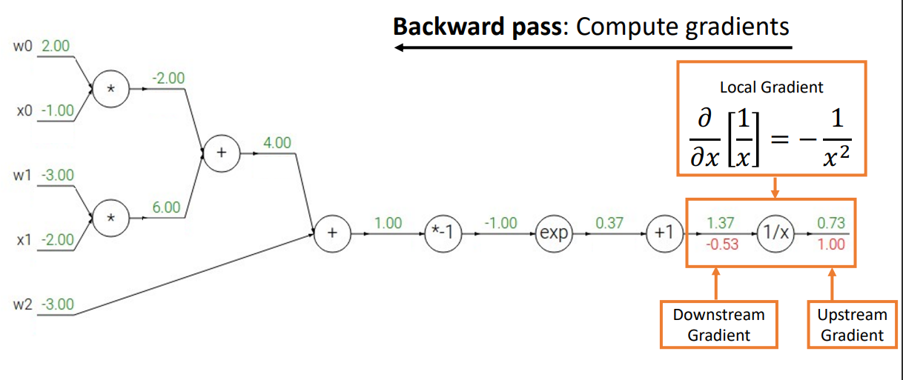

# L2 Image Classification
- A1 Released
  - Uses Python, PyTorch, and Google Colab
  -Introduction to PyTorch Tensors
  - K-Nearest Neighbor classification
  - Two challenge questions worth 2% each
# L3 Linear Classifiers
`Do Assignment 1 here`
## **Tips:**  
- Socres for classification $s = f(x_i, W)$  

- raw classifier scores as probabilities as $P(Y = k | X = x_i) = \frac{\exp(s_k)}{\sum_j{\exp(s_j)}}$

- Use Cross-Entropy Loss : $L_i = - \log P(Y = y_i | X = x_i)$

## Content 
- Linear classifiers
- Three ways to think about linear classifiers
  - Algebraic Viewpoint
  - Visual Viewpoint
  - Geometric Viewpoint
- Loss
  - Cross-Entropy (softamx) : $L_i = - log( \frac{exp(s_{y_i})}{\sum_j exp(s_{j})} )$ 

  - SVM Loss with margin : $L_i = \sum_{j\neq y_i} max(0, s_j - s_{y_i} +1 )$


# L4 Regularization + Optimization
`After this lecture, can do A2 linear classifiers section`
## 4.1 Regularization
### 正则的例子
Lets make a linear classifier, then loss: 
$$L = -log(p_y) + \lambda \sum_i w^2_i $$

if  
x = [1, 1, 1, 1]  
w_1 = [1, 0, 0, 0]  
w_2 = [0.25, 0.25, 0.25, 0.25]

$w_1^T = w_2^T = 1$
Without regularization, data loss will always be the same, L2 regularization prefers(w_2) weights to be “spread out”.

### 添加正则的loss: 训练data且防止overfit

$$L(W) = \frac{1}{N} \sum_{i=1}^N L_i (f(x_i, W), y_i) + \lambda R(W)$$

Loss function consists of data loss to fit the training 
data and regularization to prevent overfitting

### Compute Gradient
- Numeric gradient: 有限差分（finite‑difference）近似求导:
    $$\frac{df}{dx} = \lim_{h\to 0} \frac{f(x+0.00001) - f(x)}{h}  $$
- Analytic gradient: 对目标函数求导推导公式

### Gradient Descent
- Batch Gradient Descent:  基于全部训练样本更新参数.
$$ \theta^{(t+1)} = \theta^{(t)} - \alpha \nabla_{\theta}J(\theta^{(t)}) $$
- Mini‑Batch GD: 基于部分训练样本更新参数
- SGD: 基于一条样本更新参数

## 4.2 Optimization

### SDG  
```python
while True
  data_batch = sample_training_data(data, 256) # sample 256 examples, when batch = 1, it is SGD
  weight_grad = evaluate_gradient(loss_fun, data_batch, weight)
  weight += learning_rate * weight_grad # update parameter update

```

### SGD + Momentum : continue moving in the general direction as the previous iterations
$$v_{t+1} = \rho v_t + \nabla f(x_t)$$
$$w_{t+1} = w_t - \alpha v_{t+1}$$
```python
vx = 0
while True
  dx = compute_gradient(x)
  vx = rho * vx + dx
  x -= learning_rate * vx
```

### Nesterov Momentum
- 在真正计算梯度之前，先沿着上一次的动量方向“预先走一步”，再在这个“预先位置”上计算梯度。
$$v_{t+1} = \rho v_t - \alpha \nabla f(x_t + \nabla v_t)$$
$$x_{t+1} = x_t + v_{t+1} $$  
Change of variables $\tilde{x_t} = x_t + \rho v_t$ and rearrange:
$$v_{t+1} = \rho v_t - \alpha \nabla f(\tilde{x_t}) $$
$$
\begin{align}
\tilde{x_{t+1}} &=  \tilde{x_{t}} - \rho v_t + (1+\rho)v_{t+1} \\
 &= \tilde{x_{t}} + v_{t + 1} + \rho(v_{t+1} - v_t)   \\
\end{align}
$$

### RMSProp (More Complex Optimizers) 
- Root Mean Square Propagation: Progress along “steep” directions is damped; progress along “flat” directions is accelerated
- 核心思想是：对每一个参数维度(每个 weight 元素)单独记录过去梯度的平方的指数移动平均，并用这个平均值来 缩放(decay) 当前的梯度。
这样，在梯度经常很大的方向上学习率会被自动减小，而 在梯度经常很小的方向上学习率会被放大，从而实现“在陡峭方向减速、在平坦方向加速”
```python
grad_squared = 0
while True:
  dx = compute_gradient(x)
  grad_squred = decay_rate * grad_squred + (1 - decay_rate) * dx * dx
  x -= learning_rate * dx / (np.sqrt(grad_squared) + 1e-7)
```

### Optimizers: Adam
```python
first_moment = 0
second_moment = 0
for i in range(1, num_iteration):
  dx = compute_gradient(x)
  first_moment = beta1 * first_moment + (1 - beta1) * dx  # Momentum
  second_moment = beta2 * second_moment + (1 - beta2) * dx * dx # AdaGrad / RMSProp
  first_unbias = first_moment / (1 - beta1 ** t)   # Bias correction
  second_unbias = second_moment / (1 - beta2 ** t) # Bias correction
  x -= learning_rate * first_unbias / (np.sqrt(second_unbias) + 1e-7) # AdaGrad / RMSProp
```

### AdamW : Adam Variant with Weight Decay
- Q: How does regularization interact 
with the optimizer? (e.g., L2)
```python
first_moment = 0
second_moment = 0
for i in range(1, num_iteration):
  dx = compute_gradient(x)  # Standard Adam computes L2 here
  first_moment = beta1 * first_moment + (1 - beta1) * dx 
  second_moment = beta2 * second_moment + (1 - beta2) * dx * dx 
  first_unbias = first_moment / (1 - beta1 ** t)   
  second_unbias = second_moment / (1 - beta2 ** t) 
  x -= learning_rate * first_unbias / (np.sqrt(second_unbias) + 1e-7) # AdamW (Weight Decay) adds term here
```

### AdaGrad
- Progress along “steep” directions is damped; 
progress along “flat” directions is accelerated

```python
grad_squared = 0
while True:
  dx = compute_gradient(x)
  grad_squred += dx **2
  x -= learning_rate * dx / (np.sqrt(grad_squared) + 1e-7)
```
### BGFS; L-BFGS (Limited memory BFGS): 
Does not form/store the full inverse Hessian
Quasi-Newton methods (BGFS most popular):
instead of inverting the Hessian (O(n^3)), approximate 
inverse Hessian with rank 1 updates over time (O(n^2) 
each)


*Learning rate decay: Reduce learning rate at a few fixed 
points. E.g. for ResNets, multiply LR by 0.1 
after epochs 30, 60, and 90.
### Optimazation
- **Adam** is a good default choice in many cases; it 
often works ok even with constant learning rate
- **SGD+Momentum** can outperform Adam but may 
require more tuning of LR and schedule
- If you can afford to do full batch updates then try out 
**L-BFGS** (and don’t forget to disable all sources of noise)

# L5 Neural Networks
- `After Lecture 5, can do full assignment`  
- `If you have a hard time computing derivatives, wait for next lecture on backprop`

## Full-connected neural networks
$$f(x) = W_2 \sigma(W_1 \sigma(x)) $$

## Activation functions
- Rectified Linear Unit: ReLU(z) = max(0, z)
- Leaky ReLU: max(0.2x, x)
- Sigmoid:
  $$\sigma (x) = \frac{1}{1 + \exp(-x)}$$
- tanh $$tanh(x) = \frac{\exp(2x) - 1}{\exp(2x) + 1}$$
- Softplus
$$log(1+\exp(x))$$
- ELU
  $$f(x) = 
  \left\{
    \begin{aligned}
       x,  x>0\\ \alpha(\exp(x) -1), x \leq 0
    \end{aligned}
  \right. $$


## Neural Net in <20 lines!

<details>
<summary>Code, MSE loss</summary>  


</details>

# L6 Backpropagation
## Forward pass  
Compute outputs:   

## Backward  
Backward pass computes gradients:  
$$\text{Downstream Gradient} = \text{Local Gradient} \cdot \text{Upstream Gradient}$$ 
where, x = 1.37 in the Local Gradient formula  


# L7 Convolutional Networks
- A3 relased
  - Backpropagation with modular API
  - Different update rules (Momentum, RMSProp, Adam, etc)
  - Batch Normalization
  - Dropout
  - Convolutional Networks
- 